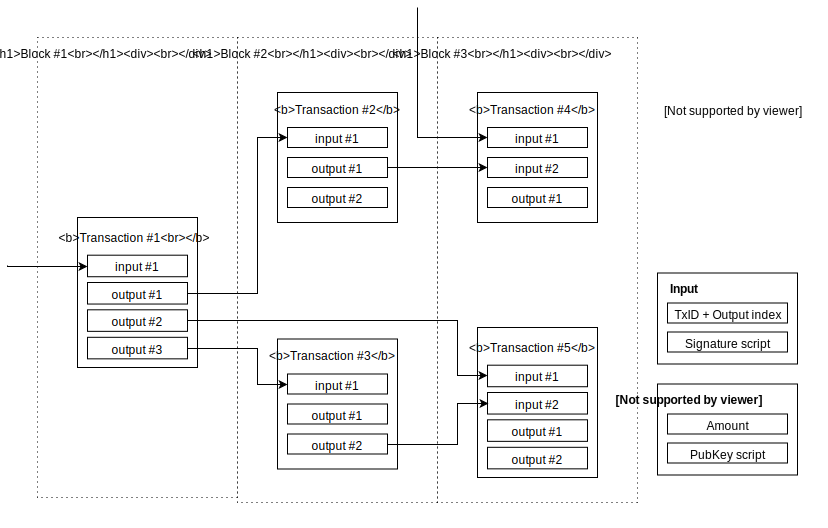

+++
title = "Test Hugo Reveal"
outputs = ["Reveal"]
[reveal_hugo]
custom_theme = "css/slides.css"
+++

#  Connect yourself to the lightning network with Go

An example with LND and lntop

---

## Bitcoin

* 1976 Asymetric encryption - Diffie-Hellman
* 1992 ECDSA - Scott Vanstone
* 1992 Cypherpunk: E. Hughes - T. May - J. Gilmore
* 1997 Hashcash - A. Black
* 1998 b-money - Wei Dai  | BitGold - N. Szabo
* 2008 Bitcoin whitepaper - S. Nakamoto
* 2009 first block mined

secp256k1: y² = x³ + 7

---

## Lightning Network

* 2013 Payment channels - Nakamoto & Core devs
* 2015 Feb *Lightning Network* - J.Poon - T.Dryja
* 2015 Nov *Reaching the ground with LN* - R. Russell
* 2017 Dec Specs V1.0 Rc | first tx on mainnet
* 2028 Avr Majors implementations are on mainnet

---

---

