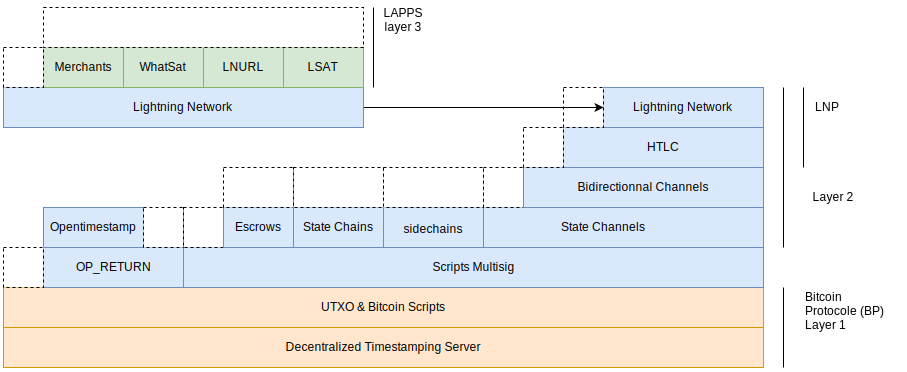

+++
title = "Chainhack 2019-11-10"
outputs = ["Reveal"]
[reveal_hugo]
highlight_theme = "vs"
custom_theme = "css/slides.css"
+++

# Chainhack project: A simple lightning Faucet using LNURL

A little application using Opennode API written in Rust.

<small>Edouard Paris - https://edouard.paris/slides/2019-11-10-chainhack4</small>

---

{}

## Lightning Network

* 2013 Payment channels - Nakamoto & Core devs
* 2015 Feb *Lightning Network* - J.Poon - T.Dryja
* 2015 Nov *Reaching the ground with LN* - R. Russell
* 2017 Dec Specs V1.0 Rc | first tx on mainnet
* 2028 Avr Majors implementations are on mainnet

---

---

# HTLC

*Hash Time Locked Contract*

* "I will give you X if you give me the preimage of H"
* H = **Payment Hash**, R = **Payment Preimage**
* **Time Locked**: If you don't give me R, I can get my money back after
    delay

Payment = **Amount** + **Payment Hash** + **Delay**

---

{}

---

---



---
